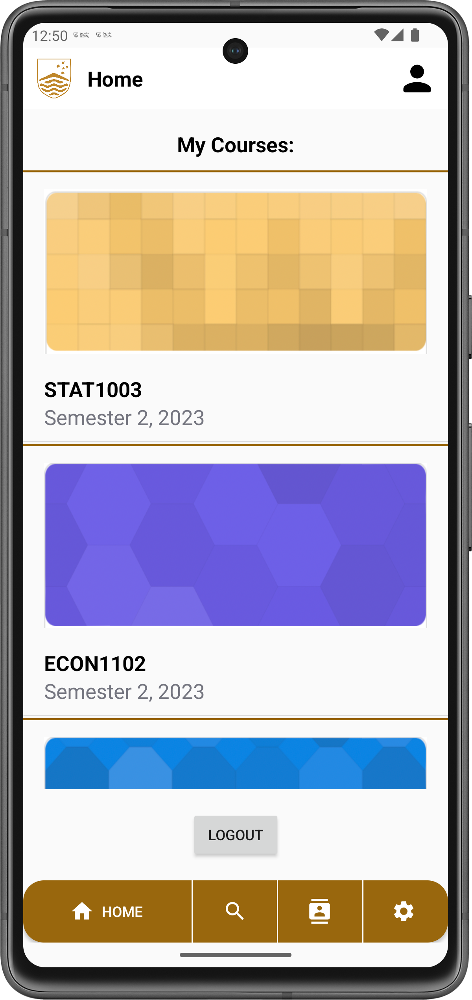
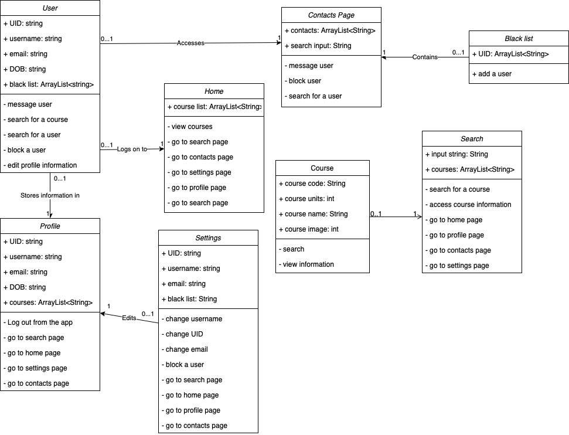

# [G03 - GA 23S2] Report

## Table of Contents

1. [Team Members and Roles](#team-members-and-roles)
2. [Summary of Individual Contributions](#summary-of-individual-contributions)
3. [Application Description](#application-description)
4. [Application UML](#application-uml)
5. [Application Design and Decisions](#application-design-and-decisions)
6. [Summary of Known Errors and Bugs](#summary-of-known-errors-and-bugs)
7. [Testing Summary](#testing-summary)
8. [Implemented Features](#implemented-features)
9. [Team Meetings](#team-meetings)
10. [Conflict Resolution Protocol](#conflict-resolution-protocol)

## Administrative
- Firebase Repository Link: <https://console.firebase.google.com/u/1/project/ga-23s2-d824e/database/ga-23s2-d824e-default-rtdb/data>
   - Confirm: I have already added comp21006442@gmail.com as a Developer to the Firebase project prior to due date.
- Two user accounts for markers' access are usable on the app's APK (do not change the username and password unless there are exceptional circumstances. Note that they are not real e-mail addresses in use):
   - Username: comp2100@anu.edu.au	Password: comp2100
   - Username: comp6442@anu.edu.au	Password: comp6442

## Team Members and Roles
The key area(s) of responsibilities for each member

| UID      |      Name       |                                                                                                                                                                        Role |
|:---------|:---------------:|----------------------------------------------------------------------------------------------------------------------------------------------------------------------------:|
| u7556893 | Gia Minh Nguyen | Backend developer, database design and managing, data sampler, make Java <=> Database bridging objects and classes, data change simulation service and notification service |
| u7499609 |  Harry Randall  |                                             Fullstack developer, P2P messaging, authentication, UI design, firebase integration, classes, recyclerView and data persistance |
| u7542145 |     An Tran     |                                                                                                Backend developer, search engine designer, Parser designer, Grammar Designer |
| u7483922 | Douglas Caroll  |                                                                                   Frontend developer, UI design and implementation, team scribe, some backend database work |

## Summary of Individual Contributions

1**u7542145, Xuan An Tran**  I have 25% contribution, as follows:  
- **Code Contribution in the final App**
    - **Data Structure Design**
        - Improved AVLTree functionalities from lab: [AVLTree.java](https://gitlab.cecs.anu.edu.au/u7499609/ga-23s2/-/blob/main/APK/app/src/main/java/com/example/comp2100_ga_23s2/objects/AVLTree.java)
    - **Search Engine Design**
        - Search Engine ranking/searching algorithms: [SearchEngine.java](https://gitlab.cecs.anu.edu.au/u7499609/ga-23s2/-/blob/main/APK/app/src/main/java/com/example/comp2100_ga_23s2/searchEngine/SearchEngine.java)
        - UserQueryToken: [UserQueryToken.java](https://gitlab.cecs.anu.edu.au/u7499609/ga-23s2/-/blob/main/APK/app/src/main/java/com/example/comp2100_ga_23s2/searchEngine/UserQueryToken.java)
        - UserQueryTokenizer: [UserQueryTokenizer.java](https://gitlab.cecs.anu.edu.au/u7499609/ga-23s2/-/blob/main/APK/app/src/main/java/com/example/comp2100_ga_23s2/searchEngine/UserQueryTokenizer.java)
        - UserQueryParser: [UserQueryParser.java](https://gitlab.cecs.anu.edu.au/u7499609/ga-23s2/-/blob/main/APK/app/src/main/java/com/example/comp2100_ga_23s2/searchEngine/UserQueryParser.java)
        - UserQuery: [UserQuery.java](https://gitlab.cecs.anu.edu.au/u7499609/ga-23s2/-/blob/main/APK/app/src/main/java/com/example/comp2100_ga_23s2/searchEngine/UserQuery.java)

- **Code and App Design**
    - Immutable AVLTree data structure that can sort User based on their username and balance itself
    - Custom compareTo method (in User class) to make User comparable by username(and secondarily uid)
    - Searching,Ranking and Reranking algorithm in SearchEngine class to return appropriate List of Users
    - SearchEngine's functionalities is condensed in the findUserInTree method. This method can handle partially invalid UserQuery
    - Context Free Grammar for UserQuery 

2. **u7483922, Douglas Carroll**  I have 25% contribution, as follows:  

- **Code Contribution in the final App**

  - UI Handler for the following classes:
      - Home page of the application: [home_page.java](https://gitlab.cecs.anu.edu.au/u7499609/ga-23s2/-/blob/main/APK/app/src/main/java/com/example/comp2100_ga_23s2/home_page.java)
      - Profile page of the application: [profile_page.java](https://gitlab.cecs.anu.edu.au/u7499609/ga-23s2/-/blob/main/APK/app/src/main/java/com/example/comp2100_ga_23s2/profile_page.java)
      - Settings page of the application: [settings_page.java](https://gitlab.cecs.anu.edu.au/u7499609/ga-23s2/-/blob/main/APK/app/src/main/java/com/example/comp2100_ga_23s2/settings_page.java)
         - This includes editing information for the profile page, which interacts with the database.  
      - Custom base adapter for the home page ListView: [CustomeBaseAdapter.java](https://gitlab.cecs.anu.edu.au/u7499609/ga-23s2/-/blob/main/APK/app/src/main/java/com/example/comp2100_ga_23s2/CustomBaseAdapter.java)
      - The code for the blacklist in the UserSampler class: [UserSampler.java](https://gitlab.cecs.anu.edu.au/u7499609/ga-23s2/-/blob/main/APK/app/src/main/java/com/example/comp2100_ga_23s2/dataSampling/dataSampler/UserSampler.java) 
         - This includes adding a blacklist to every user within the database.
      - The code for the blacklist in the contacts_page class: [contacts_page.java](https://gitlab.cecs.anu.edu.au/u7499609/ga-23s2/-/blob/main/APK/app/src/main/java/com/example/comp2100_ga_23s2/p2p_messaging/contacts/contacts_page.java) 
         - This includes retrieving the current blacklist and adding the users' input to the database.      

- **Code and App design**      

  - Layout XML files for the following layouts:
      - The portait page for the home page: [activity_home_page.xml](https://gitlab.cecs.anu.edu.au/u7499609/ga-23s2/-/blob/main/APK/app/src/main/res/layout/activity_home_page.xml)
      - The landscape page for the home page: [activity_home_page.xml](https://gitlab.cecs.anu.edu.au/u7499609/ga-23s2/-/blob/main/APK/app/src/main/res/layout-land/activity_home_page.xml)
      - The portait page for the profile page: [activity_profile_page.xml](https://gitlab.cecs.anu.edu.au/u7499609/ga-23s2/-/blob/main/APK/app/src/main/res/layout/activity_profile_page.xml)
      - The landscape page for the profile page: [activity_profile_page.xml](https://gitlab.cecs.anu.edu.au/u7499609/ga-23s2/-/blob/main/APK/app/src/main/res/layout-land/activity_profile_page.xml) 
      - The portait page for the search page: [activity_search_page.xml](https://gitlab.cecs.anu.edu.au/u7499609/ga-23s2/-/blob/main/APK/app/src/main/res/layout/activity_search_page.xml)
      - The landscape page for the search page: [activity_search_page.xml](https://gitlab.cecs.anu.edu.au/u7499609/ga-23s2/-/blob/main/APK/app/src/main/res/layout-land/activity_search_page.xml)
      - The portait page for the settings page: [activity_settings_page.xml](https://gitlab.cecs.anu.edu.au/u7499609/ga-23s2/-/blob/main/APK/app/src/main/res/layout/activity_settings_page.xml)
      - The landscape page for the settings page: 
      - The item view for the home page ListView: [home_item_view.xml](https://gitlab.cecs.anu.edu.au/u7499609/ga-23s2/-/blob/main/APK/app/src/main/res/layout/home_item_view.xml)
      - Display course for the contacts page: [activity_display_course.xml](https://gitlab.cecs.anu.edu.au/u7499609/ga-23s2/-/blob/main/APK/app/src/main/res/layout/activity_display_course.xml)

- **Other**   
   - Team scribe! 

3. **u7499609, Harry Randall** I have 25% contribution, as follows:

- **Code Contribution in the final App**
   - **P2P messaging | privacy | user interactivity**
      - Users can message each other in private: [DirectMessage_page.java](https://gitlab.cecs.anu.edu.au/u7499609/ga-23s2/-/blob/main/APK/app/src/main/java/com/example/comp2100_ga_23s2/p2p_messaging/direct_messages/directMessage_page.java)
      - Users can [block](https://gitlab.cecs.anu.edu.au/u7499609/ga-23s2/-/blob/main/APK/app/src/main/java/com/example/comp2100_ga_23s2/p2p_messaging/direct_messages/directMessage_page.java#L98-144) another user (will disable messaging)

   - **Authentication | Firebase integration**
      - Users can log in: [Login_page.java](https://gitlab.cecs.anu.edu.au/u7499609/ga-23s2/-/blob/main/APK/app/src/main/java/com/example/comp2100_ga_23s2/authentication/login_page.java)
      - Users can sign up: [SignUp_page.java](https://gitlab.cecs.anu.edu.au/u7499609/ga-23s2/-/blob/main/APK/app/src/main/java/com/example/comp2100_ga_23s2/authentication/signUp/signup_page.java)
      - Username, email, date of birth && account creation time all get stored within a user node within the Firebase realtime database on account creation.
      - Accounts comp2100@anu.edu.au && comp6442@anu.edu.au added.

   - **LoadShowData | data persistence**
      - P2P messages updates in real time, allowing for a seamless experience for the user. [Persistence function](https://gitlab.cecs.anu.edu.au/u7499609/ga-23s2/-/blob/main/APK/app/src/main/java/com/example/comp2100_ga_23s2/p2p_messaging/direct_messages/directMessage_page.java#L153-210)
      - RecyclerView ([Messages](https://gitlab.cecs.anu.edu.au/u7499609/ga-23s2/-/tree/main/APK/app/src/main/java/com/example/comp2100_ga_23s2/p2p_messaging/direct_messages), [Contacts](https://gitlab.cecs.anu.edu.au/u7499609/ga-23s2/-/tree/main/APK/app/src/main/java/com/example/comp2100_ga_23s2/p2p_messaging/contacts), [Courses](https://gitlab.cecs.anu.edu.au/u7499609/ga-23s2/-/tree/main/APK/app/src/main/java/com/example/comp2100_ga_23s2/searchCourses/searchCourse))
      - Implemented a recyclerview to display user courses, contacts, and messages. All items were loaded from the Firebase realtime database.
      - There are lots of small functions like func: [CheckIfUserExists()](https://gitlab.cecs.anu.edu.au/u7499609/ga-23s2/-/blob/main/APK/app/src/main/java/com/example/comp2100_ga_23s2/authentication/signUp/signup_page.java#L113-146) and func: [isUserBlocked()](https://gitlab.cecs.anu.edu.au/u7499609/ga-23s2/-/blob/main/APK/app/src/main/java/com/example/comp2100_ga_23s2/p2p_messaging/direct_messages/directMessage_page.java#L220-249) which implement the firebase realtime database and fetch data.

- **Code and App design**

  - I created the following attributed/pages for the UI layout (most are relative layouts):
     - Recyclerview ([directMessages](https://gitlab.cecs.anu.edu.au/u7499609/ga-23s2/-/blob/main/APK/app/src/main/res/layout/direct_messages_recycler_view.xml)), ([Courses](https://gitlab.cecs.anu.edu.au/u7499609/ga-23s2/-/blob/main/APK/app/src/main/res/layout/search_courses_recycler_view.xml)),  ([Contacts](https://gitlab.cecs.anu.edu.au/u7499609/ga-23s2/-/blob/main/APK/app/src/main/res/layout/contacts_item_view.xml))
     - [Login page](https://gitlab.cecs.anu.edu.au/u7499609/ga-23s2/-/blob/main/APK/app/src/main/res/layout/activity_login_page.xml)
     - [Sign up page](https://gitlab.cecs.anu.edu.au/u7499609/ga-23s2/-/blob/main/APK/app/src/main/res/layout/activity_signup_page.xml)
     - [Second sign up page](https://gitlab.cecs.anu.edu.au/u7499609/ga-23s2/-/blob/main/APK/app/src/main/res/layout/activity_signup_page_2.xml) 
     - [Direct messages](https://gitlab.cecs.anu.edu.au/u7499609/ga-23s2/-/blob/main/APK/app/src/main/res/layout/activity_direct_message_page.xml)
     - [Contacts page](https://gitlab.cecs.anu.edu.au/u7499609/ga-23s2/-/blob/main/APK/app/src/main/res/layout/activity_contacts_page.xml)
     - [Navbar](https://gitlab.cecs.anu.edu.au/u7499609/ga-23s2/-/blob/main/APK/app/src/main/res/layout/activity_home_page.xml#L52-118)
     - [Header](https://gitlab.cecs.anu.edu.au/u7499609/ga-23s2/-/blob/main/APK/app/src/main/res/layout/activity_home_page.xml#L10-50)
     - [Contacts page](https://gitlab.cecs.anu.edu.au/u7499609/ga-23s2/-/blob/main/APK/app/src/main/res/layout/activity_home_page.xml#L52-118)

4. **u7556893, Gia Minh Nguyen**  I have 25% contribution, as follows:  

- **Code Contribution in the final App**
    - **DataFiles | Data sampling | Read, write to Firebase**: 
      - **Libraries of sampling data**:
        - [courses.csv](https://gitlab.cecs.anu.edu.au/u7499609/ga-23s2/-/blob/main/APK/app/src/main/res/raw/courses.csv)
        - [names.csv](https://gitlab.cecs.anu.edu.au/u7499609/ga-23s2/-/blob/main/APK/app/src/main/res/raw/names.csv)
      - **Strategy pattern | mass data sampling:**
        - [CourseSampler.java](https://gitlab.cecs.anu.edu.au/u7499609/ga-23s2/-/blob/main/APK/app/src/main/java/com/example/comp2100_ga_23s2/dataSampling/dataSampler/CourseSampler.java)
        - [Sampler.java](https://gitlab.cecs.anu.edu.au/u7499609/ga-23s2/-/blob/main/APK/app/src/main/java/com/example/comp2100_ga_23s2/dataSampling/dataSampler/Sampler.java)
        - [UserSampler.java](https://gitlab.cecs.anu.edu.au/u7499609/ga-23s2/-/blob/main/APK/app/src/main/java/com/example/comp2100_ga_23s2/dataSampling/dataSampler/UserSampler.java)
      - **Classes to represent local data instances**:
        - [Users.java](https://gitlab.cecs.anu.edu.au/u7499609/ga-23s2/-/blob/main/APK/app/src/main/java/com/example/comp2100_ga_23s2/objects/User.java)
        - [Courses.java](https://gitlab.cecs.anu.edu.au/u7499609/ga-23s2/-/blob/main/APK/app/src/main/java/com/example/comp2100_ga_23s2/objects/Course.java)
        - [Assessment.java](https://gitlab.cecs.anu.edu.au/u7499609/ga-23s2/-/blob/main/APK/app/src/main/java/com/example/comp2100_ga_23s2/objects/Assessment.java)
      - **Major modifications to the following methods for read/write to realtime database**:
        - [add_user_to_db()](https://gitlab.cecs.anu.edu.au/u7499609/ga-23s2/-/blob/main/APK/app/src/main/java/com/example/comp2100_ga_23s2/authentication/signUp/signup_page_2.java#L202-267)
    - **LoadShowData | Data change notification | live data updates**:
      - [NotificationService.java](https://gitlab.cecs.anu.edu.au/u7499609/ga-23s2/-/blob/main/APK/app/src/main/java/com/example/comp2100_ga_23s2/notification/NotificationService.java)
      - Methods I wrote in other classes to integrate the service include (but not limited to):
        - [createNotificationChannel()](https://gitlab.cecs.anu.edu.au/u7499609/ga-23s2/-/blob/main/APK/app/src/main/java/com/example/comp2100_ga_23s2/home_page.java#L51-66)
        - [isServiceRunning()](https://gitlab.cecs.anu.edu.au/u7499609/ga-23s2/-/blob/main/APK/app/src/main/java/com/example/comp2100_ga_23s2/home_page.java#L51-66)
        - Some integration in the onCreate method of home_page and setting_page:
          - [Init notification channels, request permission](https://gitlab.cecs.anu.edu.au/u7499609/ga-23s2/-/blob/main/APK/app/src/main/java/com/example/comp2100_ga_23s2/home_page.java#L99-109)
          - [Start the services](https://gitlab.cecs.anu.edu.au/u7499609/ga-23s2/-/blob/main/APK/app/src/main/java/com/example/comp2100_ga_23s2/home_page.java#L181-192)
          - [Open settings shortcut button](https://gitlab.cecs.anu.edu.au/u7499609/ga-23s2/-/blob/main/APK/app/src/main/java/com/example/comp2100_ga_23s2/settings_page.java#L167-173) and the [xml layout code](https://gitlab.cecs.anu.edu.au/u7499609/ga-23s2/-/blob/main/APK/app/src/main/res/layout/activity_settings_page.xml#L92-104)
    - **LoadShowData | simulating actions in data stream**:
      - [UserActionService.java](https://gitlab.cecs.anu.edu.au/u7499609/ga-23s2/-/blob/main/APK/app/src/main/java/com/example/comp2100_ga_23s2/dataStreamSimulator/UserActionService.java)
    - [AndroidManifest](https://gitlab.cecs.anu.edu.au/u7499609/ga-23s2/-/blob/main/APK/app/src/main/AndroidManifest.xml) (Adding permissions and fixing bugs where activity names are deprecated)
    - [Helped fix a bug in contacts_page](https://gitlab.cecs.anu.edu.au/u7499609/ga-23s2/-/commit/1bd37db35bcce678ecc5111d70d9517078c1351c)

- **Code and App Design**
    - Provided ideas for the searching engine (Search content and result)
    - Implemented **Strategy Pattern**
    - Proposed and implemented the data structure on realtime database (Firebase)
    - Provided local data representation classes
    - Provided listeners and notifications for data changes in real time
    - Provided regular interval data stream simulation
    - Gave feedback and advised improvement for various layout aspect
      

- **Others**: (only if significant and significantly different from an "average contribution")
    - [Report Writing?] [Slides preparation?]*
    - Report writing
    - Slide preparation
    - Huge contribution in refactoring for example: [example1](https://gitlab.cecs.anu.edu.au/u7499609/ga-23s2/-/commit/949ecc22b77d6ffb585159154b09f92e3ed410e5), [example 2](https://gitlab.cecs.anu.edu.au/u7499609/ga-23s2/-/commit/e217e877bb5db1118809fada9e2791d1064d5b92)
    - Gradle setting debug and fine-tuning
    - Creating the APK

## Application Description

  

This is an informative and socializing application for ANU students.

This is a socializing application for ANU students.

Wattle+ is a social media application targeting ANU students. Our mission is to bring ANU students together. It acts as a search engine where students can search for others who has an aligned academic pathway and reach out to them through p2p messaging, making new friends throughout the process. Specifically, users will be able to search for other students who are doing the same courses as them, therefore sharing the same field and interests.
Users have the convenience of viewing their ongoing courses, and can stay informed about other courses in similair fields that may align with their acadmic goal. Individuals can also maintain a comprehensive record of their current courses, helping them stay organized and up to date with their academic endeavors.

### Application Use Cases and or Examples

##### Use case 1

Adam wants to find out information about a course.
1. Adam makes an account and logs on to Wattle+.
2. Adam clicks on the search icon in the middle of the navigation bar at the bottom of the screen.
3. Adam searches for a course using the course code using the searchbar at the top of the screen. Alternatively, he can scroll downwards until he finds the desired course.
4. Adam clicks on the desired course.
5. Adam reads the course information.

##### Use case 2

Eve wants to message someone she met in her tutorial, but doesn't have their contact details.
1. Eve makes an account and logs on to Wattle+.
2. Eve clicks on the contacts icon in the navigation bar at the bottom.
3. Eve searches for a user using the searchbar at the top of the screen. Alternatively, she can scroll downwards until she finds the desired user.
4. Eve clicks on the desired user.
5. Eve can now exchange messages with the user.

##### Use case 3

Adam has forgotten which courses he is taking after the midterm break.
1. Adam logs on to Wattle+.
2. The home screen has a dynamic list view that displays his current courses.

##### Use case 4

Eve wants an annoying user to stop messaging her on Wattle+.
1. Eve logs on to Wattle+.
2. Eve navigates to the contacts page, finds the desired user, and clicks on them (as shown in use case 2).
3. Eve clicks the 'block' button in the top right corner. The user can no longer send messages to Eve!

##### Use case 5

Adam wants to edit his profile detials, as he has changed his email account.
1. Adam logs on to Wattle+.
2. Adam clicks on the settings icon in the navigation bar at the bottom of the screen.
3. Adam enters his new email in the text box provided. Adam can also edit his username and UID if he so desires.
4. Adam clicks on save. His profile will now be updated to reflect these changes.

##### Use case 6

Eve wants to check her profile to see what information Wattle+ contains about her.
1. Eve logs on to Wattle+.
2. Eve clicks on the profile icon in the top right corner of any page.
3. Eve can now see her username, UID, email and date of birth.
4. Eve now wants to leave the app, so she presses the 'log out' button in the top right.

##### Target Users: Students and staff who want to connect, network and communicate

* Users can communicate and network with other users easily.
* Users can contact professors with questions on assignments or course material.
* Users can contact tutors for solving an intellectual problem.
* Staff can contact users to ask questions, clarify due dates and request meeting times.

##### Target Users: Students who need course information

* Users can search courses and find information regarding those courses
* Users can see their currently enrolled courses

##### Targets Users: ANU students

* John wants to make new friends in the uni whose interests are aligned with him*
* John does not often wander around the campus*
* John finds it hard to find friends with the same interests*
* John goes into the app, searches for a course, which returns the students who are in the course*
* John selects a student and start texting them with P2P messaging feature to make new friends*
* As they are in the same course, they already have a common interest to start the conversation*

 

### Application UML

  

## Code Design and Decisions

**Services**
- Services include the [NotificationService](https://gitlab.cecs.anu.edu.au/u7499609/ga-23s2/-/blob/main/APK/app/src/main/java/com/example/comp2100_ga_23s2/notification/NotificationService.java) and [UserActionService](https://gitlab.cecs.anu.edu.au/u7499609/ga-23s2/-/blob/main/APK/app/src/main/java/com/example/comp2100_ga_23s2/dataStreamSimulator/UserActionService.java)
  - Notification and user action simulation are two features that runs throughout the app cycle.
  - Services were used so that the functions can run in the background, uninterrupted when switching activity.
- [NotificationService](https://gitlab.cecs.anu.edu.au/u7499609/ga-23s2/-/blob/main/APK/app/src/main/java/com/example/comp2100_ga_23s2/notification/NotificationService.java):
  - Designed in such way that it will listen for all data events on the database.
  - It is very sensitive and will not miss a change
  - However, it does send a lot of notification that cannot be muted individually.
  - Another approach for this service is to implement the Observer Pattern, and send a notification only when called upon in another activity. However, as the goal is to provide immediate notification on changes in database and using observer pattern on services requires creating intents which causes stutters in the program. Hence, the current solution is more suitable for the application.
- [UserActionService](https://gitlab.cecs.anu.edu.au/u7499609/ga-23s2/-/blob/main/APK/app/src/main/java/com/example/comp2100_ga_23s2/dataStreamSimulator/UserActionService.java):
  - The purpose is to illustrate the app's ability to listen for changes in database in real-time
  - As calling methods from other Android classes are challenging because of the encapsulation, this service only recreate a simple user action which is creating an account. It was also to reduce the amount of redundant code in the program
  - Creating a user adds an attribute to the database. To not make the database grow indefinitely, the created user would then be removed after set time.
  - To make the data stream feels more natural, random user account are made and the interval between the events are randomised anywhere from 25 seconds to 55 seconds.

### Data Structures

1. *AVLTree*
   * *Objective: used for storing Users for [Search] feature*
   * *Code Locations: defined in [AVLTree] class [AVLTree.java](https://gitlab.cecs.anu.edu.au/u7499609/ga-23s2/-/blob/main/APK/app/src/main/java/com/example/comp2100_ga_23s2/objects/AVLTree.java); processed using [findClosestUsersTree] and [findUserInTree] in [SearchEngine] class [SearchEngine.java](https://gitlab.cecs.anu.edu.au/u7499609/ga-23s2/-/blob/main/APK/app/src/main/java/com/example/comp2100_ga_23s2/searchEngine/SearchEngine.java#L45-104)*
   * *Reasons:*
      * *It is more efficient than ArrayList (both size n) for finding k Users with certain username/uid with a time complexity of O(log(n)+k) using the 2 Stack Method used in [findClosestUsersTree]*
      * *The Users return by the look-up will have similar name to the target User since those Users would be the targetUser successors/predecessors.*
      * *The AVLTree could also be flattened to a List in O(n) time for non-username type of User look-up, used in the method [findClosestUsersList] in [SearchEngine] class [SearchEngine.java](https://gitlab.cecs.anu.edu.au/u7499609/ga-23s2/-/blob/main/APK/app/src/main/java/com/example/comp2100_ga_23s2/searchEngine/SearchEngine.java#L26-35)*
      * *Last but not least, it balances itself when the absolute value of the BalanceFactor is more than 1, which allow us to maintain the worst(and amortized) look-up time of O(log(n)),compared to a regular BinaryTree's O(n) worst look-up time*
2. *Stack*
   * *Objective: used to keep track of both successors and predecessors relative to a target User. This helps with finding 'k' closest values to target through in-order and reverse in-order traversal*
   * *Code Locations: defined as final fields in [AVLTree] class [AVLTree.java](https://gitlab.cecs.anu.edu.au/u7499609/ga-23s2/-/blob/main/APK/app/src/main/java/com/example/comp2100_ga_23s2/objects/AVLTree.java#235-236); processed using [initPredecessor],[initSuccessor],[getNextPredecessor],[getNextSuccessor],[kClosestValues] in [AVLTree.java](https://gitlab.cecs.anu.edu.au/u7499609/ga-23s2/-/blob/main/APK/app/src/main/java/com/example/comp2100_ga_23s2/objects/AVLTree.java#L245-328)*
   * *Reasons:*
      * *Keeps track of values that are closest but greater/lesser than the target(or equal) in the successors and predecessors Stack respectively. We can thus find the closest possible User to target User by comparing each stack's tops through peek().*
      * *pop() and push() are constant time operation and are easier to use than ArrayList as they require no indexing*

### Design Patterns

1. Strategy Pattern
   * *Objective: used for creating data instances to be feed into the app (Basic feature #2).*
   * *Code Locations: defined in [dataSampling.dataSampler package](https://gitlab.cecs.anu.edu.au/u7499609/ga-23s2/-/tree/main/APK/app/src/main/java/com/example/comp2100_ga_23s2/dataSampling/dataSampler)
   * *Reasons:*
      * Flexibility: each sampling algorithm are encapsulated, therefore it will be easier to implement a new sampling strategy (if needed) without affecting existing code.
      * Interchangeability: There are multiple components in the database that need to be sampled, Strategy pattern allow easy switch between these sampler, increasing program's modularity and testability
      * Improved Testability: Each sampling strategy can be tested in isolation and are independent, eliminating extra dependencies, making testings easier
      * Cleaner code: avoid monolithic classes, improve readability and maintainability as each concrete strategy defines a context for sampling.

 
### Parser

### <u>Grammar(s)</u>

Production Rules:

    <query> ::= <expressionList>
    <expressionList> ::= <expression> | <expression> <space> <expNo_ID_No_Username> |  <exp_ID_Or_Username> | <exp_ID_Or_Username> <space> <expNo_ID_No_Username>
    <expNo_ID_No_Username> ::= <course> | <course> <space> <expNo_ID_No_Username>
    <exp_ID_Or_Username> ::= <id> <space> <username> | <username> <space> <id>
    <expression> ::= <id> | <course> | <username>
    <id> ::= id:u <uid>
    <uid> ::= int
    <course> ::= course: <courseCode>
    <courseCode> ::= L L L L D D D D
    L ::= 'A' | 'B' | ... | 'Z'
    D ::= '0' | '1' | ... | '9'
    <username> ::= AlphaNumericString
    <space> ::= “ “

1. **Design**
   * *I start off with a simple grammar that requires the username, uid and courses to be input in that exact order,which limit the user's ability to look for what they actually want(for example: User1 needs to look up for a user with the uid:u1234567, but they do not have the other person's username)*
   * *The grammar was then modified to contain a series of more than 1 <expression> which in turn makes the grammar ambiguous, thus difficult to parse into a UserQuery*
   * *After a few designs, I have decided to use an expressionList to reinforce the uniqueness of uid and username for the strings that the grammar accepts,i.e. only at most only 1 uid and 1 username for a string.*
   * *This was done by creating 2 other types of expressions <expNo_ID_No_Username> and <exp_ID_Or_Username>, where the former only produces <course> and the latter creates exactly 1 uid and 1 username in any order*
   * *With that, the final grammar should now be unambiguous due to the strict ordering of <output> and would except a wider range of (non-empty) user queries*
2. **Advantages**
   * *The <query> rule accepts more query compositions, including individual uids, courses, usernames, or combinations of such. This flexibility allows the grammar to interpret a wide variety of query formats.*
   * *Semantics are explicitly placed within the production rules. For instance, the <id> rule begins with id:u, and the <course> rule starts with course:, which makes the intentions of the query clear.*
   * *The grammar is modular, with each concept (e.g., uid, course, username) having its own production rule. This design facilitates easy modifications or extensions. For instance, if a new attribute for users or courses is introduced, it can be added without drastically altering the entire grammar.*
   * *For the convenience of user, the uid and username could be entered in any order.*

### <u>Tokenizers and Parsers</u>

1. **Usage**
   * *Primarily used in [searchForUser] in [contacts_page.java](https://gitlab.cecs.anu.edu.au/u7499609/ga-23s2/-/blob/main/APK/app/src/main/java/com/example/comp2100_ga_23s2/p2p_messaging/contacts/contacts_page.java#L227-270)*
2. **Construction**
   * *Regular Expressions: Tokenizers often employ regular expressions, as seen in UserQueryTokenizer, to identify patterns (an Enum type in UserQuery Token) in the input string and extract corresponding UserQueryToken in [UserQueryToken.java](https://gitlab.cecs.anu.edu.au/u7499609/ga-23s2/-/blob/main/APK/app/src/main/java/com/example/comp2100_ga_23s2/searchEngine/UserQueryToken.java).*
   * *The Tokenizer converts a valid user query (that matches the grammar above) in the contacts_page to a List of UserQueryToken. If an illegal Token is found, the IllegalTokenException will be thrown and caught by the searchForUser method and "Invalid Token Found" Toast is shown for User.Additionally, the Tokenizer could autofill/auto-truncate the uid Token to 7 digits,if found.*
   * *With the List of UserQueryToken, the Parser parse the List of Tokens by traversing through it one Token at a time by incrementing the pos field through [accept()] in [UserQueryParser.java](https://gitlab.cecs.anu.edu.au/u7499609/ga-23s2/-/blob/main/APK/app/src/main/java/com/example/comp2100_ga_23s2/searchEngine/UserQueryParser.java#L28-33)*
   * *The Parser's helper parsing functions follows the structure of the grammar. As the grammar moves from one production rule to another, the Parser's helper functions will mirror that movement. For example when parsing an expressionList, we would expect an expression and thus a call to expression() is made. [UserQueryParser.java](https://gitlab.cecs.anu.edu.au/u7499609/ga-23s2/-/blob/main/APK/app/src/main/java/com/example/comp2100_ga_23s2/searchEngine/UserQueryParser.java#L63-92)*
   * *Additionally, the Parser also catches any exception where the wrong ordering of token/unexpected token is provided. This exception will be caught by [searchForUser] again to display appropriate Toast.*
   * *The Parser is also built to handle trailing <Space> since we defined <Space> as a valid non-terminal symbol, through the use of the consumeSpace() method [UserQueryParser.java](https://gitlab.cecs.anu.edu.au/u7499609/ga-23s2/-/blob/main/APK/app/src/main/java/com/example/comp2100_ga_23s2/searchEngine/UserQueryParser.java#134-139)*
3. **Advantages**
   * *The design follows the grammar closer which makes it easy to track the parsing logic(for example a call to expressionList() is followed by a call to expression()).*
   * *This also improved the readability of the code for those who is familiar with the grammar.*
   * *By using patterns (regex) and recursive parsing methods, the code can handle a wide variety of user inputs and adapt to changes or expansions in the query structure.*
   * *The Parser and Tokenizer could handle invalid inputs which could raises exceptions that crashes the app.*

## Implemented Features

### Basic Features
1. [LogIn]. Description of the feature ... (easy)
    -   Code: [Login page](https://gitlab.cecs.anu.edu.au/u7499609/ga-23s2/-/blob/main/APK/app/src/main/res/layout/activity_login_page.xml), [Sign up page](https://gitlab.cecs.anu.edu.au/u7499609/ga-23s2/-/blob/main/APK/app/src/main/res/layout/activity_signup_page.xml), [Second sign up page](https://gitlab.cecs.anu.edu.au/u7499609/ga-23s2/-/blob/main/APK/app/src/main/res/layout/activity_signup_page_2.xml)
    -   This feature implemented the firebase authentication system. It had error handling and would also provide users with the ability to sign up.
     

2. [DataFiles] Populates the realtime database with sample data for the app's functions to utilize.
    - Code: [UserSampler](https://gitlab.cecs.anu.edu.au/u7499609/ga-23s2/-/blob/main/APK/app/src/main/java/com/example/comp2100_ga_23s2/dataSampling/dataSampler/UserSampler.java), [CourseSampler](https://gitlab.cecs.anu.edu.au/u7499609/ga-23s2/-/blob/main/APK/app/src/main/java/com/example/comp2100_ga_23s2/dataSampling/dataSampler/CourseSampler.java), [Sampler interface](https://gitlab.cecs.anu.edu.au/u7499609/ga-23s2/-/blob/main/APK/app/src/main/java/com/example/comp2100_ga_23s2/dataSampling/dataSampler/Sampler.java)
    - Resources (csv files): [courses list](https://gitlab.cecs.anu.edu.au/u7499609/ga-23s2/-/blob/main/APK/app/src/main/res/raw/courses.csv), [name list](https://gitlab.cecs.anu.edu.au/u7499609/ga-23s2/-/blob/main/APK/app/src/main/res/raw/names.csv)
    - The csv files hold the possible data value, utilize simple BeSpoke format.
    - CourseSampler reads courses.csv and upload the listed courses with randomly generated courses' assessments
    - UserSampler reads the *name list* which contains a list of first names and last names. It will randomly put a first and last name together to form the user's name, as well as generate a random UID for the user, and assigns the user to four random courses.
    - With the implementation, a lot of data can be generated and all generated users will be unique and feels natural.
        

3. [LoadShowData] load data from Firebase in realtime and visualize in the app. Provides notifications from interactions simulated on the data stream.
   - Code: [NotificationService](https://gitlab.cecs.anu.edu.au/u7499609/ga-23s2/-/blob/main/APK/app/src/main/java/com/example/comp2100_ga_23s2/notification/NotificationService.java), [DataStreamSimulation](https://gitlab.cecs.anu.edu.au/u7499609/ga-23s2/-/blob/main/APK/app/src/main/java/com/example/comp2100_ga_23s2/dataStreamSimulator/UserActionService.java), and other read/write/listener methods scattered throughout the activities. 
   - Notification service for notifying users of changes from the database
   - UserActionService is used to periodically make changes to the database to simulate other user interaction.
   - Both services run in the background and does not interfere with other activities.
     

4. [Search] A search engine for users to look up information inside the app
    - Code: [SearchEngine](https://gitlab.cecs.anu.edu.au/u7499609/ga-23s2/-/blob/main/APK/app/src/main/java/com/example/comp2100_ga_23s2/searchEngine/SearchEngine.java), [UserQuery](https://gitlab.cecs.anu.edu.au/u7499609/ga-23s2/-/blob/main/APK/app/src/main/java/com/example/comp2100_ga_23s2/searchEngine/UserQuery.java), [UserQueryParser](https://gitlab.cecs.anu.edu.au/u7499609/ga-23s2/-/blob/main/APK/app/src/main/java/com/example/comp2100_ga_23s2/searchEngine/UserQueryParser.java), [UserQueryToken](https://gitlab.cecs.anu.edu.au/u7499609/ga-23s2/-/blob/main/APK/app/src/main/java/com/example/comp2100_ga_23s2/searchEngine/UserQueryToken.java), [UserQueryTokenizer](https://gitlab.cecs.anu.edu.au/u7499609/ga-23s2/-/blob/main/APK/app/src/main/java/com/example/comp2100_ga_23s2/searchEngine/UserQueryTokenizer.java)
    - Data structure (AVL tree): [AVLTree](https://gitlab.cecs.anu.edu.au/u7499609/ga-23s2/-/blob/main/APK/app/src/main/java/com/example/comp2100_ga_23s2/objects/AVLTree.java)
    - Allows users to lookup other users using different input i.e. uid, name
    - Follows a well-designed grammar.
    - Utilizes stack to return close results.

### Custom Features
Feature Category: Search-related Feature
1. [Search-Invalid] Handle/Autocorrect invalid inputs by the user (medium)
   -    Code: [contacts_page](https://gitlab.cecs.anu.edu.au/u7499609/ga-23s2/-/blob/main/APK/app/src/main/java/com/example/comp2100_ga_23s2/p2p_messaging/contacts/contacts_page.java#227-270)
   -    This code handle inputs that are not parse-able into a UserQuery by letting the User knows through a Toast through handling exceptions.
   -    It also uses the Tokenizer's ability to autofill/autotruncate the uid of a search to 7 digits so that we could look up for User with uid closest to the autocompleted uid
   -    Moreover, the user could provide an incomplete username which the AVLTree could return the User with the most similar usernam.
   -    The searchEngine would also handle what to return to user depends on what information in the search input is missing,e.g. username, uid or courses
Feature Category: Firebase Authentication

1.  [FB-Auth] Use Firebase to implement User Authentication/Authorisation. (easy)
    -   Code: [Login page](https://gitlab.cecs.anu.edu.au/u7499609/ga-23s2/-/blob/main/APK/app/src/main/res/layout/activity_login_page.xml)
    -   This code authenticates the user from the firebase authentication system.

2. [FB-Persist] Use Firebase to persist all data used in your app. (medium)
   -   Code: [Persistence function](https://gitlab.cecs.anu.edu.au/u7499609/ga-23s2/-/blob/main/APK/app/src/main/java/com/example/comp2100_ga_23s2/p2p_messaging/direct_messages/directMessage_page.java#L153-210)
    -   This code for the Peer to Peer messaging would update in realtime (i.e when a change was made in the database) thus users could send a message and receive it instantly.

Feature Category: Peer to Peer messaging

1. [P2P-DM] Provide users with the ability to message each other directly in private. (hard) 
   -   Code: [DirectMessage_page.java](https://gitlab.cecs.anu.edu.au/u7499609/ga-23s2/-/blob/main/APK/app/src/main/java/com/example/comp2100_ga_23s2/p2p_messaging/direct_messages/directMessage_page.java)
   - This code allowed users to message each other. The messages are updated in real time and are stored in the realtime database.
    
2. [P2P-Block] Provide users with the ability to ‘block’ and prevent another user from direct messaging them. (medium)
   -   Code: [block user class](https://gitlab.cecs.anu.edu.au/u7499609/ga-23s2/-/blob/main/APK/app/src/main/java/com/example/comp2100_ga_23s2/p2p_messaging/direct_messages/directMessage_page.java#L98-144)
   - This function allowed the user to block another user and see realtime changes. When a user is blocked, the user who blocked them will no longer receive messages from them (the other user can still send messages but this is a feature). 

5. [User notification] User will receive a notification when they receive or send a message.
    - Code: [NotificationService](https://gitlab.cecs.anu.edu.au/u7499609/ga-23s2/-/blob/main/APK/app/src/main/java/com/example/comp2100_ga_23s2/notification/NotificationService.java)
    - Notifies users of coming P2P messages so they know to respond.
    - Also notifies outcoming message to confirm that message has been sent

Feature Category: UI Design and Testing

1. [UI-Layout] Incorporate suitable layout adjustments in the UI components for portrait and landscape layout variants, as well as different screen sizes.
   - All pages have custom built layouts in the form of XML files.  

Feature Category: Greater Data Usage, Handling and Sophistication

1. [Data-Profile] Create a Profile Page for Users or any Entities, which contains a media file (image, animation
   (e.g. gif), video). 
   - Code: [Profile page](https://gitlab.cecs.anu.edu.au/u7499609/ga-23s2/-/blob/main/APK/app/src/main/java/com/example/comp2100_ga_23s2/profile_page.java)
   - Users can also edit the profile through settings. 

### Surprised Features

- Suprised feature is not implemented.

  

## Summary of Known Errors and Bugs

1. *Bug 1:*
   - *You can change your details on the settings page to one of another user.*
   - *This could allow a user to aquire sensative information and or admin privileges.*

2. *Bug 2:*
    - Some notifications are unintentionally sent everytime the app is launched.
    - *It does not affect user experience in any way.*
3. *Bug 3*
    - The search course page search bar does not work. Our search function is on the contacts page
    - *This was not finished and not removed. Please disregard.*

  

## Testing Summary

No JUnit or UI testing was done for the assignment.

Testing related to database and app functions are mainly done through manual app testing.

  

## Team Management

### Meetings Records

- [Team Meeting 1](https://gitlab.cecs.anu.edu.au/u7499609/ga-23s2/-/blob/main/items/Meeting1.md)
   -  Initial meeting, roles, responsibilities, and general direction discussed and agreed upon. 
- [Team Meeting 2](https://gitlab.cecs.anu.edu.au/u7499609/ga-23s2/-/blob/main/items/meeting2.md)
   -  Progress check, main features of the app in progress. 
- [Team Meeting 3](https://gitlab.cecs.anu.edu.au/u7499609/ga-23s2/-/blob/main/items/meeting3.md)
   -  Functionality main focus of project now, everything starting to come together. 
- [Team Meeting 4](https://gitlab.cecs.anu.edu.au/u7499609/ga-23s2/-/blob/main/items/meeting4.md)
   -  Final items to be completed discussed alongside priorities closer to deadline. Everything is close to completion. 

### Conflict Resolution Protocol

- [Conflict resolution protocol](https://gitlab.cecs.anu.edu.au/u7499609/ga-23s2/-/blob/main/items/conflictResolution.md)
